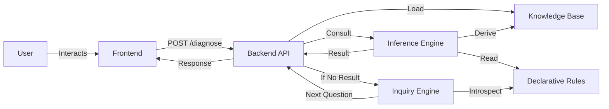

# DeDoc Technical Documentation

## 1. System Overview
DeDoc is a **Web-Based Expert System** utilizing **First-Order Logic (FOL)** for medical diagnosis. Unlike statistical or machine learning models, DeDoc uses a deterministic, rule-based approach to ensure explainability and strict adherence to medical protocols.

### 1.1 Key Features
*   **Deterministic Reasoning**: Results are binary (Diagnosis Found / Not Found) based on strict rules.
*   **Explainability**: Every derived fact and diagnosis can be traced back to the foundational symptoms.
*   **Dynamic Inquiry**: The system dynamically generates the next best question based on the current state of knowledge, rather than following a static decision tree.

---

## 2. Architecture
The system follows a **Client-Server** model.

### 2.1 Technology Stack
*   **Frontend**: HTML5, Vanilla CSS, Vanilla JavaScript.
*   **Backend**: Python 3.10+, FastAPI.
*   **Communication**: REST API (JSON).

### 2.2 Data Flow Diagram


---

## 3. Core Logic Modules

### 3.1 Knowledge Base (`app/logic/facts.py`)
A transient, in-memory store for the current session's facts.
*   **Fact Structure**: `(predicate, subject, object)`
*   **Example**: `("has_symptom", "patient_01", "fever")`

### 3.2 Declarative Rules (`app/logic/declarative_rules.py`)
The "Brain" of the system. Contains strict implications.
*   **Structure**: `Rule(Name, Consequence, [Conditions])`
*   **Example**:
    ```python
    Rule("diag_flu", ("possible_diagnosis", "influenza"), [
        Condition("has_symptom", "fever"),
        Condition("has_symptom", "cough")
    ])
    ```

### 3.3 Inference Engine (`app/logic/inference.py`)
Implements **Forward Chaining**.
*   **Algorithm**:
    1.  Load known facts.
    2.  Iterate through all Rules.
    3.  If a Rule's conditions are met by current facts, add the Consequence to facts.
    4.  Repeat until no new facts are added (Fixed Point).

### 3.4 Inquiry Engine (`app/logic/inquiry.py`)
Implements **Backward Chaining** introspection.
*   **Purpose**: To determine what to ask next when diagnosis is inconclusive.
*   **Algorithm**:
    1.  Find all Rules that conclude a `possible_diagnosis`.
    2.  Filter out Rules that are already contradicted (e.g., Rule requires Fever, but user said NO to Fever).
    3.  Collect all missing conditions from the remaining viable rules.
    4.  Select the most frequent missing condition as the next question.

---

## 4. API Specification

### POST `/diagnose`
**Request**:
```json
{
  "symptoms": ["fever", "cough"],
  "symptoms_no": ["headache"]
}
```

**Response**:
```json
{
  "status": "completed",
  "inferred_diseases": ["influenza"],
  "clinical_states": ["systemic_illness"],
  "explanation": [
      "CLINICAL STATE: SYSTEMIC ILLNESS",
      "POSSIBLE DIAGNOSIS: INFLUENZA"
  ],
  "next_question": null
}
```

---

## 5. Development Setup

### 5.1 Prerequisites
*   Python 3.8 or higher.
*   `pip` package manager.

### 5.2 Installation
```bash
# 1. Clone
git clone https://github.com/wole-abraham/dedoc.git
cd dedoc

# 2. Virtual Env
python -m venv venv
source venv/bin/activate  # Windows: venv\Scripts\activate

# 3. Dependencies
pip install -r requirements.txt
```

### 5.3 Running (Dev)
```bash
uvicorn app.main:app --reload
# Endpoint: http://127.0.0.1:8000/diagnose
```
